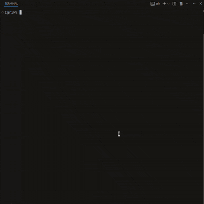
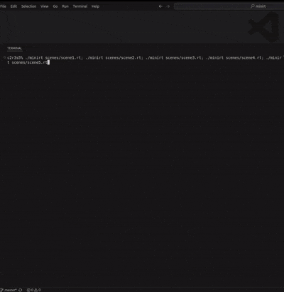
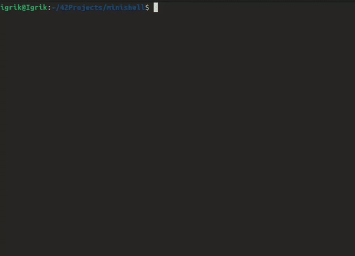
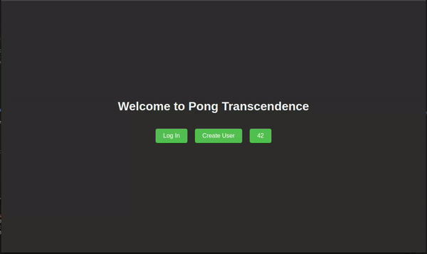

# Hi there, I'm Igor Votintsev!
### Software Developer | 42 Prague Graduate

- I completed **42 Prague** in record time (6 months).
- Work in Skoda as C++ developer.
---

## My Projects

| Project Name      | Description | Tech Stack | GIF Showcase | Repo |
|-------------------|-------------|------------|--------------|------|
| **Learn2Slither** | A reinforcement learning project where a snake learns to navigate and survive through Q-learning | Python, TensorFlow/Keras, Reinforcement Learning |  | [GitHub Link](https://github.com/ivotints/Learn2Slither) |
| **Gomoku AI**     | An intelligent Gomoku game with advanced AI using minimax algorithm and optimized heuristics | Python, C++, AI |  | [GitHub Link](https://github.com/ivotints/gomoku) |
| **MiniRT**        | A minimalistic raytracer implementing various 3D shapes, lighting and shadows | C, MiniLibX, Mathematics |  | [GitHub Link](https://github.com/ivotints/minirt) |
| **Minishell**     | A custom shell replicating Bash functionality. | C, Shell, Linux |  | [GitHub Link](https://github.com/ivotints/minishell) |
| **Cub3D**         | A 3D raycasting game inspired by Wolfenstein 3D. | C, MiniLibX, Graphics |  | [GitHub Link](https://github.com/ivotints/cube3d) |
| **Full-Stack Website** | A responsive full-stack website using Vanilla JS. | HTML, CSS, JS, API |  | [GitHub Link](https://github.com/ivotints/ft_transcendence) |

---

### Connect With Me
[LinkedIn](https://linkedin.com/in/igor-votintsev)
